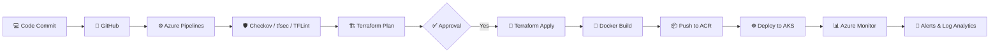

<h1 align="center">Hi 👋, I'm Madhup Ranjan Pandey</h1>

  

🙋‍♂️ About Me
I'm Madhup Ranjan Pandey
I'm an 𝐀𝐳𝐮𝐫𝐞 𝐃𝐞𝐯𝐎𝐩𝐬 & 𝐃𝐞𝐯𝐒𝐞𝐜𝐎𝐩𝐬 𝐄𝐧𝐠𝐢𝐧𝐞𝐞𝐫 with 𝟭𝟮+ 𝘆𝗲𝗮𝗿𝘀 𝗼𝗳 𝗲𝘅𝗽𝗲𝗿𝗶𝗲𝗻𝗰𝗲 in cloud infrastructure, automation, and platform engineering. I specialize in Microsoft Azure, Terraform, Azure DevOps, GitHub Actions, Docker, Kubernetes, Linux, and CI/CD. My work focuses on designing secure, scalable, and automated cloud environments using Infrastructure as Code (IaC), implementing DevSecOps practices, and optimizing deployments for performance, governance, and cost efficiency. I'm passionate about continuous learning and building modern cloud-native solutions.

• 🔭 Currently working on Azure infrastructure automation using 𝗧𝗲𝗿𝗿𝗮𝗳𝗼𝗿𝗺 and 𝗔𝘇𝘂𝗿𝗲 𝗟𝗮𝗻𝗱𝗶𝗻𝗴 𝗭𝗼𝗻𝗲 patterns
• ⚙️ Building and maintaining 𝗖𝗜/𝗖𝗗 𝗽𝗶𝗽𝗲𝗹𝗶𝗻𝗲𝘀 with GitHub Actions and Azure DevOps
• ☸️ Deploying and operating containerized workloads on 𝗔𝘇𝘂𝗿𝗲 𝗞𝘂𝗯𝗲𝗿𝗻𝗲𝘁𝗲𝘀 𝗦𝗲𝗿𝘃𝗶𝗰𝗲 (𝗔𝗞𝗦)
• 🔐 Embedding 𝗗𝗲𝘃𝗦𝗲𝗰𝗢𝗽𝘀 𝗽𝗿𝗮𝗰𝘁𝗶𝗰𝗲𝘀 into pipelines — policy checks, secret scanning, and IaC validation
• 📚 Currently learning 𝗔𝗪𝗦, 𝗔𝗜𝗢𝗽𝘀, 𝗮𝗻𝗱 𝗵𝗼𝘄 𝗟𝗟𝗠𝘀 are being applied to cloud operations
• 🎯 Focused on creating reliable cloud infrastructure through automation, security, and best practices.
• 💬 Always excited to collaborate on Azure, DevSecOps, Terraform, GitHub Actions, and Kubernetes.

## 💼 𝗖𝗼𝗿𝗲 𝗘𝘅𝗽𝗲𝗿𝘁𝗶𝘀𝗲

| Domain | Technologies & Expertise |
|--------|---------------------------|
| ☁️ **𝗖𝗹𝗼𝘂𝗱 𝗣𝗹𝗮𝘁𝗳𝗼𝗿𝗺** | Microsoft Azure • Landing Zones • Resource Governance • Cost Management |
| 🏗️ **𝗜𝗻𝗳𝗿𝗮𝘀𝘁𝗿𝘂𝗰𝘁𝘂𝗿𝗲 𝗮𝘀 𝗖𝗼𝗱𝗲** | Terraform • Modules • Remote Backend • Workspaces • State Management |
| ⚙️ **𝗗𝗲𝘃𝗢𝗽𝘀 & 𝗖𝗜/𝗖𝗗** | Azure DevOps • GitHub Actions • YAML Pipelines • Continuous Integration & Delivery |
| ☸️ **𝗖𝗼𝗻𝘁𝗮𝗶𝗻𝗲𝗿𝘀 & 𝗢𝗿𝗰𝗵𝗲𝘀𝘁𝗿𝗮𝘁𝗶𝗼𝗻** | Docker • Kubernetes (AKS) • Container Deployment & Management |
| 🔒 **𝗗𝗲𝘃𝗦𝗲𝗰𝗢𝗽𝘀** | IaC Security • Secret Scanning • Policy as Code • Compliance Automation |
| 🌐 **𝗡𝗲𝘁𝘄𝗼𝗿𝗸𝗶𝗻𝗴 & 𝗜𝗱𝗲𝗻𝘁𝗶𝘁𝘆** | Virtual Networks • NSGs • Load Balancers • Microsoft Entra ID • RBAC |
| 📈 **𝗠𝗼𝗻𝗶𝘁𝗼𝗿𝗶𝗻𝗴 & 𝗥𝗲𝗹𝗶𝗮𝗯𝗶𝗹𝗶𝘁𝘆** | Azure Monitor • Log Analytics • Application Insights • Alerting & Diagnostics |

## 🚀 Technical Expertise

  

##  Microsoft Azure

•  Microsoft Entra ID, MFA, PIM, and RBAC
•  Azure Landing Zone, Management Groups, Azure Policy
•  VNet, NSG, Load Balancer, Application Gateway, Bastion, VPN Gateway
•  Private Endpoints & Private DNS
•  VM, VMSS, Storage Accounts, Managed Identity, Availability Zones

##  Terraform (Infrastructure as Code)

• 🏗️ Building reusable, modular Terraform configurations for repeatable deployments
• 🗂️ Managing Terraform Workspaces and Remote State Backends with state locking
• ⚙️ Writing lifecycle rules and variables to support multi-environment provisioning
• 🚀 Automating Azure Landing Zone components through Infrastructure as Code

##   CI/CD & Automation

• 🚀 Designing **YAML-based CI/CD pipelines** using Azure DevOps and GitHub Actions
• ⚙️ Automating infrastructure provisioning and application deployments across multiple environments
• 🔄 Managing release workflows with rollback strategies and deployment approvals
• 🧪 Implementing Continuous Integration (CI) and Continuous Deployment (CD) best practices
• 🔐 Integrating security, quality checks, and automated testing into CI/CD pipelines
• 📦 Deploying Infrastructure as Code (Terraform) through automated pipelines

##   Containers & Kubernetes

•  🐳 Docker Containerization
• ☸️ Azure Kubernetes Service (AKS)
• 📦 Deployments, Services, ConfigMaps, Secrets &  Ingress
• 🔄 Rolling Updates & Zero-Downtime Deployments
•  📈 Autoscaling & High Availability
• 🔍 Kubernetes Monitoring & Troubleshooting

##  🛡️ DevSecOps, Security & Governance

• 🔒 IaC Security – Checkov, tfsec & TFLint
• 🛡️ Secret Detection – TruffleHog
•  💰 Cost Analysis – Infracost
• 🔑 Azure Key Vault Integration
•  🏷️ Resource Locks, Tagging & Cost Governance
• 📋 Azure Policy, RBAC & Microsoft Entra ID

##  📊 Monitoring & Observability

• 📈 Azure Monitor & Log Analytics Workspace
• 🚨 Azure Alerts & Diagnostic Settings
• 🔍 Application Insights Monitoring
• 📊 Metrics, Activity Logs & Resource Health
• 📋 Azure Monitor Workbooks & Dashboards
• ⚡ Proactive Monitoring & Performance Optimization

##      Version Control & Scripting

• 🌿 Git, GitHub & Azure Repos
• 🔀 Branching Strategy, Pull Requests & Code Reviews
• 💻 PowerShell, Bash & Linux Automation
• ⚙️ Git Versioning & Repository Management
• 🚀 VS Code for Infrastructure as Code (IaC) Development

## ⚡ Azure DevSecOps CI/CD Pipeline

## 🚀 Currently Exploring

-   AWS & Multi-Cloud Architecture
• 🤖 AIOps & Intelligent Automation
• 🧠 MLOps & Machine Learning Operations
• 🔗 Model Context Protocol (MCP)
• 📚 Retrieval-Augmented Generation (RAG)
• 🤖 AI Agents & Enterprise LLM Applications

## 🤝 Connect With Me

  

  

  

- 💼 **LinkedIn:** https://www.linkedin.com/in/mrpandey-azure-devops/
- 💻 **GitHub:** https://github.com/mrpandey93-create
- 📧 **Email:** pandeymr330@gmail.com
- 🌐 **Portfolio:** Coming Soon 🚧

> ⭐ *"Automate Everything. Secure by Default. Build for Scale."* ⭐
> 

